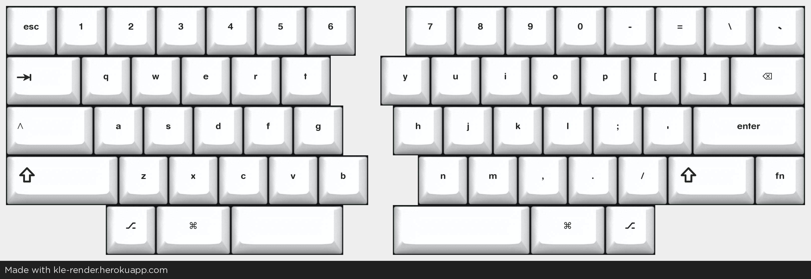

# ex split hhkb

HHKB is a layout that's really close to my heart. I've grown past my rubberdome days and started to develop some slight RSI which made me think I should build a split version of the hhkb. It's probably not good for RSI but it could at least be a good looking keyboard.

## Layout

[Keyboard Layout Editor](http://www.keyboard-layout-editor.com/#/gists/6ef4b1bafb20e3eab4d866f9d219c640)

### Spacebar

The layout is currently is a regular hhkb layout with a split spacebar. Left side uses a 2.25U spacebar and the right side uses a 2.75U spacebar which is still 1U shorter than the hhkb with its 6U spacebar. Design-wise this is breaking the hhkb look-and-feel and due to this I had to adjust the left alt/ctrl (1U mod) more to the right. This is subject to change.

Layout render is done with [KLE Render](https://kle-render.herokuapp.com/) - thanks to [u/CQ_Cumbers/](https://www.reddit.com/user/CQ_Cumbers/)
